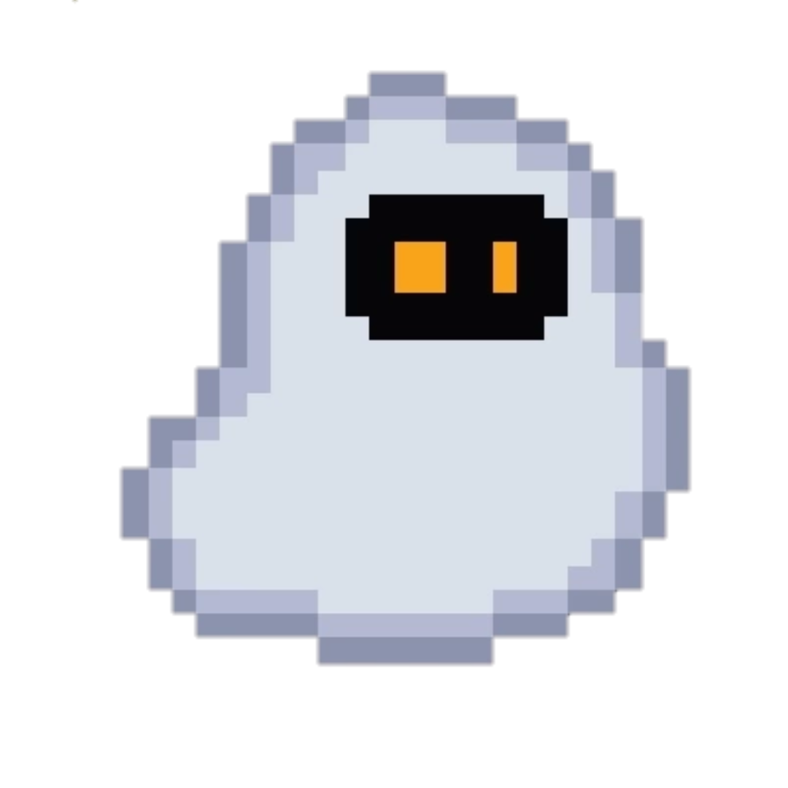

<p align="center"></p>
<h1 align="center">Hi there, I'm <a href="https://github.com/filcherock">FILCHER</a> 
</h1>
<div align="center">
  
</div>

---

### :man_technologist: About Me 
Hi! I'm Filcher, my real name is Philip. I program in Python and C++. I want to become a Full-Stack programmer and am developing in this direction. Over the years, I have tried to create games, write my own interpreters, websites, GUI applications and much more
- :telescope: I create GUI applications, websites and telegram bots
- :zap: In my free time I watch movies and play games.
- :information_source: My project -> [click](https://github.com/filcherock/my-project-info)
- :mailbox: You can contact me via telegram -> @filcherock

#### My device
``` bash
Type: Laptor
Core: Intel Core I5-12450H
Videocard: NVIDIA GeForce RTX 3050 Laptor
RAM: 8gb
OS: Windows 10, Arch Linux
My Favourite IDE: Visual Studio Code
```

---

### :hammer_and_wrench: My Skill Set  
<table><tr><td valign="top" width="33%" align="center">


### Programming Languages  
---
<div align="center">  
<a href="https://www.python.org/" target="_blank"></a>  
<a href="https://en.wikipedia.org/wiki/HTML5" target="_blank"></a>  
<a href="https://www.w3.org/Style/CSS/Overview.en.html" target="_blank"></a>  
<a href="https://www.cprogramming.com/" target="_blank"></a>  
<a href="https://www.cplusplus.com/" target="_blank"></a>  
<a href="https://docs.microsoft.com/en-us/dotnet/csharp/" target="_blank"></a>  
<a href="https://www.open-std.org/jtc1/sc22/wg14/" target="_blank"></a>  
<a href="https://www.php.net/" target="_blank"></a>  
</div>

</td><td valign="top" width="33%" align="center">


### Frameworks, libraries and DB  
---
<div align="center">  
<a href="https://www.djangoproject.com/" target="_blank"></a>  
<a href="https://www.electronjs.org/" target="_blank"></a>  
<a href="https://www.mysql.com/" target="_blank"></a>
<a href="https://firebase.google.com/" target="_blank"></a>
<a href="https://jquery.com/" target="_blank"></a>  
</div>

</td><td valign="top" width="33%" align="center">


###  Tools and Technology  
---
<div align="center">  
<a href="https://git-scm.com/" target="_blank"></a>  
<a href="https://unity.com/" target="_blank"></a>  
<a href="https://dotnet.microsoft.com/download/dotnet-framework" target="_blank"></a>  
<a href="https://www.blender.org/" target="_blank"></a>  
<a href="https://www.figma.com/" target="_blank"></a>  
<a href="https://www.arduino.cc/" target="_blank"></a>  
</div>

</td></tr></table>

---

### :robot: Stats
[](https://git.io/streak-stats)
[](https://github.com/anuraghazra/github-readme-stats)
[](https://github.com)
[
